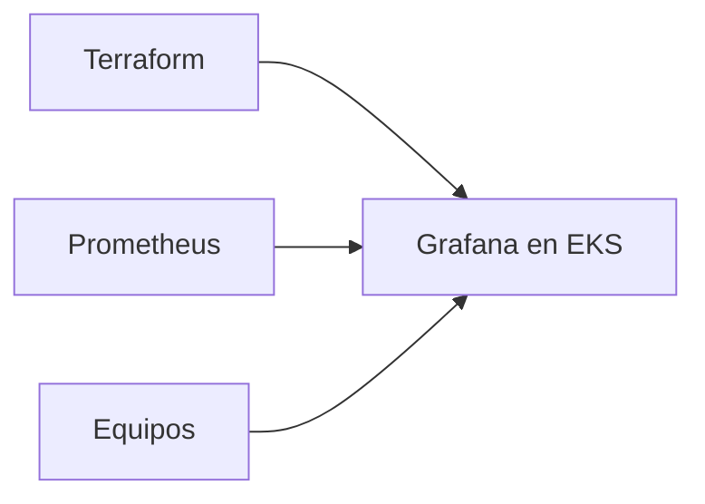

# Grafana en EKS

[](LICENSE)
[](https://www.terraform.io/)
[](https://aws.amazon.com/)
[](https://github.com/ghcetraro/terraform_aws_eks_grafana/actions/workflows/ci.yml)

**Grafana en EKS con Terraform — observabilidad lista para conectar a Prometheus**

---

## El problema

Levantar Grafana en el cluster suele quedar como chart ad-hoc, sin el mismo estándar de IaC que el resto de la plataforma.

## La solución

Módulo Terraform + manifests para desplegar Grafana en EKS de forma reproducible (timezone y lookback alineables a operación).



---

## Características

| Área | Detalle |
|------|---------|
| **Grafana** | Despliegue en EKS vía Terraform |
| **Manifests** | Configuración versionada en el repo |
| **IaC** | Mismo flujo init/plan/apply |
| **Ops** | Pensado para conectar Prometheus/datasources |

---

## Limitaciones y disclaimer

- Pensado como **punto de partida / referencia**: revisá roles IAM, redes y secretos antes de producción.
- Requiere **credenciales AWS** (recomendado SSO) y, en módulos EKS, acceso al cluster (kubeconfig / exec).
- Completá `locals` y variables según tu cuenta; los ejemplos usan valores ficticios.
- Software open source “as is” — probá primero en un ambiente no productivo.

---

## Stack

Terraform · EKS · Grafana · Kubernetes manifests

---

## Inicio rápido

### Requisitos

- Terraform CLI 1.x
- AWS CLI configurado (`aws sso login` o credenciales)
- Permisos de administración en la cuenta / cluster según el módulo

### Configuración

```bash
# En cada módulo: copiá la plantilla (no commitear terraform.tfvars)
cp terraform.tfvars.example terraform.tfvars
```

Valores de ejemplo: `terraform.tfvars.example`

### Apply

```bash
cp terraform.tfvars.example terraform.tfvars
# Editar valores (cuenta, región, cluster, etc.)

terraform init
terraform plan
terraform apply
```

---

## Documentación

- [Uso y despliegue](docs/uso.md)
- [Presentación / LinkedIn](docs/PRESENTACION.md)
- [Speech para LinkedIn](docs/speech-linkedin.md)
- [Changelog](CHANGELOG.md)
- [Contribuir](CONTRIBUTING.md)
- [Seguridad](SECURITY.md)

---

## Seguridad

**No commitees** `terraform.tfvars`, state, claves ni tokens. Usá `*.tfvars.example` como plantilla.

Ver [SECURITY.md](SECURITY.md).

---

## Licencia

[MIT](LICENSE) — Copyright (c) Gabriel Cetraro

---

## Autor

Proyecto open source de **Gabriel Cetraro** — automatización de infraestructura, AWS, Kubernetes y observabilidad.

Si te resulta útil, ⭐ en GitHub ayuda a darle visibilidad.
