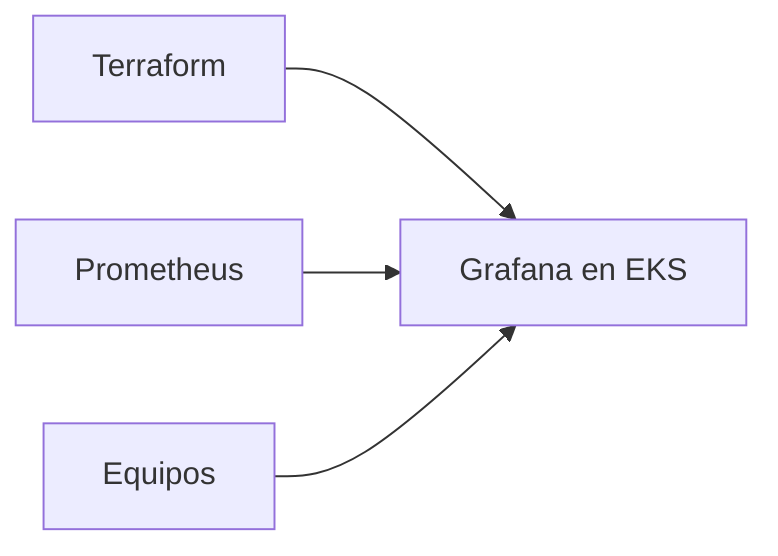

# Presentación — Grafana en EKS

Material listo para publicar en **LinkedIn** (post + carrusel). Copiá cada sección como una diapositiva o bloque del post.

**Speech listo para copiar/pegar:** [speech-linkedin.md](speech-linkedin.md)

---

## Slide 1 — Hook

### Grafana en EKS con el mismo rigor que el resto de tu IaC

Presento **Grafana en EKS**: Grafana en EKS con Terraform — observabilidad lista para conectar a Prometheus

Terraform · EKS · Grafana · Kubernetes manifests

---

## Slide 2 — El dolor

- Charts sueltos sin versionar bien
- Cada ambiente diverge
- Observabilidad que no se puede recrear

**Automatizar esto no es lujo — es repetibilidad.**

---

## Slide 3 — Qué hace

---

## Slide 4 — Características

- **Grafana**: Despliegue en EKS vía Terraform
- **Manifests**: Configuración versionada en el repo
- **IaC**: Mismo flujo init/plan/apply
- **Ops**: Pensado para conectar Prometheus/datasources

---

## Slide 5 — Cómo probarlo

1. Cloná el repo
2. Copiá `terraform.tfvars.example` → `terraform.tfvars`
3. `terraform init && plan && apply`
4. Revisá outputs / recursos en la consola AWS

Repo: `https://github.com/ghcetraro/terraform_aws_eks_grafana`

---

## Slide 6 — CTA

Open source · MIT · listo para adaptar a tu cuenta.

⭐ Si te sirve, estrella en GitHub y compartí feedback.

`https://github.com/ghcetraro/terraform_aws_eks_grafana`
